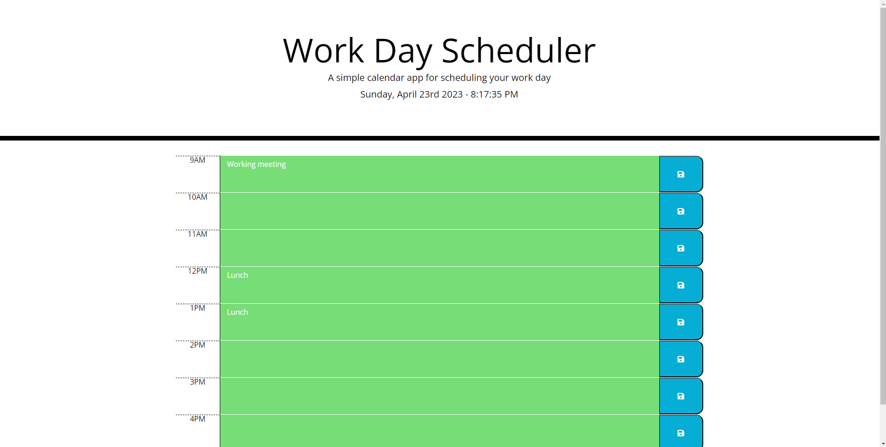

# <Challenge 5: Creating a Work Planner>

## Description

<li>Used my knew knowledge of JQuery and previous knowledge of JavaScript to create a work planner
<li>Learned how to work better with JQuery
<li>Learned more about BootStrap and the quality of life change it provides for CSS
<li>Learned more about JavaScript being mixed inbetween JQuery code and having it still work
<li>Learned more about HTML and BootStrap being used together within the HTML

## Installation

Installing this code is very easy. Following the link to the repo listed down below, we can see the code that was used to get this planner working properly. Having your work team use this is very simple as well, all you have to do it send them the link to the planner itself, and information can be shared easily within  the planner.

## Usage

Using the actual planner itself is very simple, you simply click on a date, put whatever information you want in it, and click the save button. Boom! Just like that your planner has whatever you wrote in it!

# Screenshot

---
# <Link to Repo With Source Code>

https://github.com/diazgus411/Chall5
---